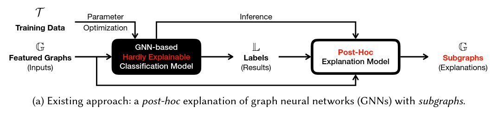
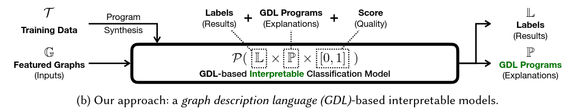
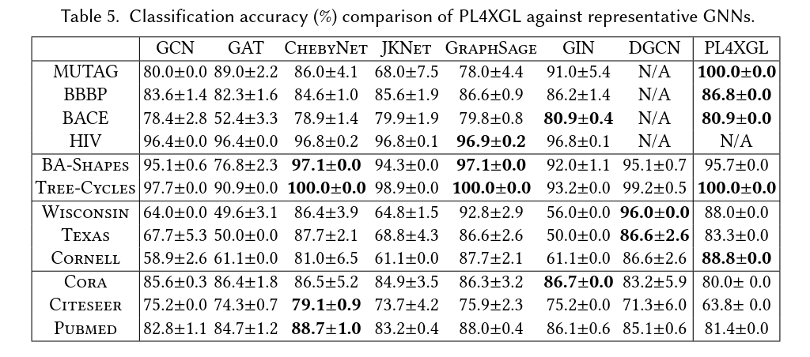

#+title: PL4XGL: A Programming Language Approach to Explainable Graph Learning
#+subtitle: https://doi.org/10.1145/3656464
#+author: Juhun Lee
#+options: h:2 toc:nil num:t
#+latex_class: beamer
#+latex_class_options: [presentation,table,10pt,aspectratio=169]
#+latex_header: \usepackage{stmaryrd}
#+latex_header: \usepackage{tikz}
#+latex_header: \usetikzlibrary{graphs, graphs.standard}
#+latex_header_extra: \institute{FCAI Lab \\Yonsei University}
#+columns: %45item %10beamer_env(env) %10beamer_act(act) %4beamer_col(col)
#+beamer_theme: fcai

* Motivation and Background

** Why should neural networks be /explainable?/
- Neural networks are essentially /black boxes/
- This opacity causes many issues:
  - Trust :: Hard to justify decisions to users or domiain experts
  - Debugging :: Difficult to understand why a particular output is wrong
  - Safety and risk :: No clear guarantee that decisions are made for acceptable reasons
- Providing /explanataions/ can:
  - Increase trust and acceptance
  - Help debug and improve models
  - Support safety, fairness, and accountability

** What is a Graph Neural Network?

*** Left
:PROPERTIES:
:beamer_col: 0.45
:END:
- A /graph/ consist of the following elements:
  - *Nodes* can have a feature vector each
  - *Edges* connect pairs of nodes, with optional features
  - *Label* used to label the result (optional)

*** Right
:PROPERTIES:
:beamer_col: 0.45
:END:
#+begin_center
An example input graph to a GNN
#+end_center

#+begin_export latex
\null
\begin{center}
  \begin{tikzpicture}
    \graph[nodes={circle, draw, fill=blue!20},]{
      A -- {B, C} -- D;
      A -- E;
    };
  \end{tikzpicture}
\end{center}
#+end_export

** What is a Graph Neural Network? (cont'd)

*** Left
:PROPERTIES:
:beamer_col: 0.45
:END:
- How *message-passing* neural networks (MPNN) work
  1. Each node starts with an initial feature vector \( h^{(0)}_{v} \)
  2. For layer \( k = 1 \dots K \):
     1. Each node collects messages from neighbors
     2. Aggregate neighbor embeddings with permutation-invariant operations
     3. Combine aggregated message with its own previous state
     4. Update the state of itself
  3. After \( K \) layers, node embeddings capture information from the \( K \)-hop neighborhood

*** Right
:PROPERTIES:
:beamer_col: 0.45
:END:
#+begin_center
An example input graph to a GNN
#+end_center

#+begin_export latex
\null
\begin{center}
  \begin{tikzpicture}
    \graph[nodes={circle, draw, fill=blue!20},]{
      A -- {B, C} -- D;
      A -- E;
    };
  \end{tikzpicture}
\end{center}
#+end_export

** What is a Graph Neural Network? (cont'd)

*** Left
:PROPERTIES:
:beamer_col: 0.45
:END:
- How to make predictions from MPNN
  - Node classification :: Apply classifier to each or specific node embedding
  - Graph classification :: Pool all node embeddings to get a graph embedding, then classify

*** Right
:PROPERTIES:
:beamer_col: 0.45
:END:
#+begin_center
An example input graph to a GNN
#+end_center

#+begin_export latex
\null
\begin{center}
  \begin{tikzpicture}
    \graph[nodes={circle, draw, fill=blue!20},]{
      A -- {B, C} -- D;
      A -- E;
    };
  \end{tikzpicture}
\end{center}
#+end_export

** The /explanation/ of a Graph Neural Network

*** Left
:PROPERTIES:
:beamer_col: 0.45
:END:
- An *explanation* is usually a /subgraph/ (with possibly important features) that "supports" the prediction
- Examples:
  - For /graph classification/, a small subgraph that is sufficient for the model to output the same label
  - For /node classification/, a subgraph around the node that is most influential
- "This part of a graph is /why/ the model predicted label \( \ell \)"

*** Right
:PROPERTIES:
:beamer_col: 0.45
:END:
#+begin_center
An example input graph to a GNN
#+end_center

#+begin_export latex
\null
\begin{center}
  \begin{tikzpicture}
    \graph[nodes={circle, draw, fill=gray!20},]{
      A[fill=blue!20] -- {B, C[fill=blue!20]} -- D[fill=blue!20];
      A -- E;
    };
  \end{tikzpicture}
\end{center}
#+end_export

** Current approach to explaining a GNN

The existing approach has the following issues:
- High Cost :: Explanation requires additional optimization or combinatorial search
- Correctness :: Is the explanation of a classification guaranteed to be /correct?/
  
  #+begin_center
Can we build a model that is *inherently explainable* with explanation /by construction/?
  #+end_center

* PL4XGL Overview

** PL4XGL in a nutshell

- Introduce the *Graph Description Language (GDL)*
- Replace the existing "GNN + explainer" pipeline with a single, interpretable model in GDL

** PL4XGL in a nutshell (cont'd)

A PL4XGL model is a finite set of /GDL programs/ with:
- A /label/ (or /class/)
- A /quality score/

** PL4XGL in a nutshell (cont'd)

For a given input node or graph:
1. Find all programs that match it
2. Pick the programs with the best score
3. Use:
   - The program's label as the *prediction*
   - The program itself as the *explanation*

** How is it different from conventional model

*** GNN + explainer
:PROPERTIES:
:beamer_col: 0.45
:beamer_env: block
:END:
- Two distinct stages and modes
  1. GNN classifies input into labels
  2. Explainer generates possible explanation
- Explanations are extra const and approximate

*** PL4XGL
:PROPERTIES:
:beamer_col: 0.45
:beamer_env: block
:END:
- Just one model
  - \Rightarrow GDL programs /are/ the logic of classification
- Classification and explanation are the same operation
- Expalnations are /guaranteed/ of faithfulness with respect to the PL4XGL model

* The Graph Description Language (GDL)

** GDL in a nutshell
- A GDL program describes a /pattern/ over:
  - Node features
  - Edge features
  - Graph structure
- Each program has a *target kind*:
  - ~target node~ :: Describes a set of nodes
  - ~target edge~ :: Describes a set of edges
  - ~target graph~ :: Describes a set of graphs

** GDL syntax --- Node descriptions
#+begin_src gdl
  node x <[l1, u1], ..., [ld, ud]>
#+end_src

- Introduce a *symbolic node* ~x~
- The concrete node bound to ~x~ must have a feature vector:
  - Total dimension of \( d \)
  - Dimension \( i \) in the interval \( [ l_i, u_i ] \)
- Intervals can be:
  - bounded (e.g., [0, 1.5])
  - unbounded (e.g., [-\infty, 0.3], [5, \infty])
- These intervals allow abstracting many concrete values at once

** GDL syntax --- Edge descriptions
#+begin_src gdl
  edge (x, y) <[l1, u1], ..., [ld, ud]>
#+end_src

- There must be an edge from node ~x~ and ~y~
- The edge's feature vector must lie inside the specified intervals

** GDL syntax --- Target specifier
#+begin_src gdl
  target node x
  target edge (x, y)
  target graph
#+end_src

- The *target* determines whether the program describes:
  - Nodes
  - Edges
  - Whole graphs

** GDL semantics
- *Valuation*
  - Mapping of symbolic nodes (~x~, ~y~, ~z~, etc.) to distinct concrete nodes in a graph
- A valuation /satisfies/ a prgram if:
  - Node feature intervals are respected
  - Required edges exist and edge feature intervals are respected
- Program semantics
  - \( \llbracket P \rrbracket \) :: The set of all concrete nodes/edges/graphs that can be obtained as the target under some satisfying valuation
- A program defines a *set of instances* that match a pattern

** Example GDL program

*** Left
:PROPERTIES:
:beamer_col: 0.6
:END:
#+begin_src gdl
  node x <[3, 10]>
  node y

  edge (x, y)

  target node y
#+end_src

"All nodes ~y~ that have a neighbor ~x~ whose feature value is between 3 and 10."

This program can be used as:
- A /classifier/ (labels attached to this program)
- An /explanation/ (clear patterns understandable by humans)

*** Right
:PROPERTIES:
:beamer_col: 0.3
:END:
#+begin_export latex
\begin{tikzpicture}
  \graph[nodes={circle, draw, fill=gray!20}]{
    x[fill=blue!20, label=above:{\( x \)}] --[->] y[fill=blue!20, label=above:{\( y \)}];
    y --[dashed] {z1, z2};
  };
\end{tikzpicture}
#+end_export

** Generality order on programs
- We define a partial order operator \( \sqsubseteq \) on GDL programs:
  - \( P \sqsubseteq Q \) if \( \llbracket P \rrbracket \subseteq \llbracket Q \rrbracket \)
  - "\( P \) is more specific than \( Q \)"
- Use in learning:
  - Prefer *more general* programs when quality scores are equal
  - Avoid overfitting to single components
- General programs \rightarrow applies to more examples, captures a broader pattern
- Specific programs \rightarrow very tight pattern, may overfit

* PL4XGL Model and Training

** Model structure
- Learned model \( M \) is a finite set of triples \( (\ell, P, q) \):
  - \ell :: label (class)
  - P :: GDL program
  - q \in [0, 1] :: quality score
- Include a trivial *top program* \( \top \) that matches everything
  - Quality score of 0
- Every component is covered by at least one program

** Prediction procedure
Given a component \( c \) (node, edge, or graph):
1. Consider all triples \( (\ell, P, q) \) in \( M \) such that \( c \in \llbracket P \rrbracket \)
2. Select the triple with the *highest* quality score \( q \)
3. Output:
   - \( \ell \) as the /prediction/
   - \( P \) as the /explanation/
   - \( q \) as a /confidence/quality/ measure for that explanation

** Training data and quality score
- The training set \( T \) is a set of labeled components \( (c, \ell) \)
- For each label \( \ell \), \( T(\ell) = \lbrace c ~| ~ (c, \ell) \in T \rbrace \)
- For candidate pair \( (\ell, P) \),
  - Quality Score \[ \text{Score}_{T}(\ell, P) = \frac{|\llbracket P \rrbracket \cap T(\ell)|}{|\llbracket P \rrbracket| + \epsilon} \]
  - \epsilon \gt 0 is the /smoothing hyperparameter/
- *Smoothed precision*
  - How many matches of \( P \) actually have label \( \ell \)?
  - Penalizes very small and very broad programs

** Learning objectives
- Desired properties of the learned model:
  - Coverage :: Every training example is matched by some non-trivial program
  - High quality :: Programs have good \( \text{Score}_{T}(\ell, P) \)
  - Generality :: Given similar quality, prefer more general programs
- Optimization is /not/ done via gradient descent
  - Space of GDL programs is discrete and combinatorial
  - Use a *program synthesis* approach with local search

** Generic synthesis algorithm
- For each training pair \( (c, \ell) \):
  1. Initialize a /starting program/ \( P \)
  2. Repeat:
     1. Generate a set of candidate mutations \( P^\prime \in \text{Mutate}(P) \)
     2. Keep candidates that:
        - Still cover the example: \( c \in \llbracket P^\prime \rrbracket \)
        - Have higher quality: \( \text{Score}_{T}(\ell, P^\prime) > \text{Score}_{T}(\ell, P) \)
        - Same quality but more general: \( \text{Score}_{T}(\ell, P^\prime) = \text{Score}_{T}(\ell, P) \) and \( P \sqsubset P^\prime \)
     3. If such candidates exist, choose one and set \( P \leftarrow P^\prime \)
     4. If not, stop
- This is a /greedy local search/ in program space

** Top-down synthesis
- Start from the most general program, \( \top \)
- Mutations *specialize* the program:
  - AddNode :: Add a node description
  - AddEdge :: Add an edge between symbolic nodes
  - SpecializeNode :: Narrow node feature intervals
  - SpecializeEdge :: Narrow edge feature intervals
- Used for *node classification* tasks

** Bottom-up synthesis
- Start from a highly specific program describing the example's local pattern
- Mutations *generalize* the program
  - RemoveNode :: Remove a node description
  - RemoveEdge :: REmove an edge description
  - GeneralizeNode :: Widen node feature intervals
  - GeneralizeEdge :: Widen edge feature intervals
- Used for *graph classification* tasks

** Making GDL make sense
- Converting the chosen GDL program into an actual *subgraph* explanation
- For a given input graph:
  1. Find valuations of \( P \) that satisfy the program
  2. Collect nodes and edges participating in those valuations
- The resulting subgraph /explains/ the decision
- This subgraph is guaranteed to have the *same label* under PL4XGL as the original input

* Evaluation

** Experimental setup
- Tasks:
  - *Graph classification*
    - Molecular property prediction (e.g., MUTAG, BBBP, BACE, HIV)
  - *Node classification*
    - Synthetic motif datasets (e.g., BA-Shapes, Tree-Cycles)
    - Web graphs (e.g., Wisconsin, Texas, Corness)
    - Citation networks (e.g., Cora, Citeseer, Pubmed)
- Baselines:
  - Several GNN architectures (e.g., GCN, GIN, GAT, etc.)
  - Post-hoc explainer (i.e., @@beamer:\textsc{SubgraphX}@@)

** Research questions
- RQ1: Explanation cost :: How expensive is it to produce explanations at inference time?
- RQ2: Explanation correctness :: How faithful and sparse are the explanations?
- RQ3: Predictive performance :: How does PL4XGL's accuracy compare to standard GNNs?

** RQ1 --- Explanation cost

*** SubgraphX
:PROPERTIES:
:beamer_col: 0.45
:beamer_env: block
:END:
- Performs a search over subgraphs
- Evaluates the GNN many times per instance
- On larger datasets, total explanation time can be *hours* or *days*

*** PL4XGL
:PROPERTIES:
:beamer_col: 0.45
:beamer_env: block
:END:
- Explanation is /built into/ the model
- \Rightarrow Selecting the best program is the same as making a prediction
- No additional inference-time cost beyond lookup and scoring

*** Result
- Classification + explanation with PL4XGL is reported to be *at least tens of times faster* than GNN + @@beamer:\textsc{SubgraphX}@@ explanations
- PL4XGL's *training* can be more expensive and may time out on the largest dataset

** RQ2 --- Explanation correctness
- *Fidelity*
  - Compare labels for original input and explanation subgraph
  - Typically reported as an error rate \rightarrow lower is better
- *Sparsity*
  - Fraction of nodes (or edges) removed by the explanation
  - Smaller explanation subgraphs are easier for humans to understand \rightarrow higher is better

** RQ2 --- Explanation correctness (cont'd)

*** SubgraphX
:PROPERTIES:
:beamer_col: 0.45
:beamer_env: block
:END:
- Fidelity and sparsity depends heavily on hyperparameters (e.g., allowed subgraph size)
- Fidelity is not guaranteed to be zero

*** PL4XGL
:PROPERTIES:
:beamer_col: 0.45
:beamer_env: block
:END:
- *Fidelity is zero* on evaluated tasks
  - Explanation subgraphs always get the same label as the full input
- Produces *sparse* explanations
  - Usually around 20% of the original nodes

*** Result
PL4XGL provides *guaranteed faithful* explanations with small subgraphs.

** RQ2 --- Explanation correctness (cont'd)
- For graph classification, PL4XGL selects a program \( P \) that best describes a graph \( G \)
- By construction, all graphs or subgraphs in \( \llbracket P \rrbracket \) receive the same input label under the model
- The explanation subgraph is derived from \( P \)
- Thus, the explanation subgraph is an instance described by \( P \)
- \Rightarrow The explanation subgraph must be classified with the same label as \( G \)

** RQ3 --- Classification accuracy

** RQ3 --- Classification accuracy (cont'd)
- On several datasets, PL4XGL is:
  - *State-of-the-art or best*
    - MUTAG, BBBP, BACE (molecular dataset)
    - Tree-cycles (synthetic)
  - *Competitive* (BA-shapes, Wisconsin, Texas, Cornell)
- On citation networks (Cora, Citeseer, Pubmed):
  - PL4XGL *underperforms* compared to GNNs

*** Result
- GDL is expressive enough for many structural and feature patterns
- But may struggle to capture homophilic graphs where deep message passing has significant contribution

* Discussion and Conclusion

** Limitations of PL4XGL
- *GDL struggles to express homophilic relationship*
  - "neighbors tend to have the same label" relationship
  - Complex global constraints or counts
  - The likely reason for weaker performance on citation networks
- *Computation cost of training is high*
  - Training via program synthesis is expensive
  - On very large datasets, synthesis may time out and need pruning
- *Model size is larger than competitiors*
  - Learned model can contain multiple programs
  - Only a subset of those may be frequently used at test time

** GDL vs. subgraph explanations
- Subgraph-based explainers focus on /one specific subgraph/ as an explanation
- GDL can encode /any single subgraph/ pattern
  - Feature intervals describe infinite families of subgraphs
  - Programs can express structural and feature constraints at a more abstract level
- GDL provides rich, flexible, and comprehensible descriptions for humans

** Key takeaways

*** PL4XGL
- Introduces *GDL*, a small domain-specific language for interpretable graph patterns
- Represents the model as a set of *labeled programs*
- Produces explanations *by construction* at no extra inference cost
- Guarantees *perfect fidelity* of explanations with respect to the model

*** Tradeoffs
- Limited expressiveness compared to depp GNNs on some tasks
- Heavier training cost and potential scalability challenges

** Future research directions
- Extending GDL to express homophillic relationships
- Implementing more efficient synthesis algorithm to reduce training cost
- Employing pruning techniques to reduce the amount of GDL programs in a learned model
- When should we prefer an *inherently explainable* model over a traiditional *subgraph-based* approach?

** Questions and answers
#+begin_center
/Thank you for listening./

/Any questions?/
#+end_center
