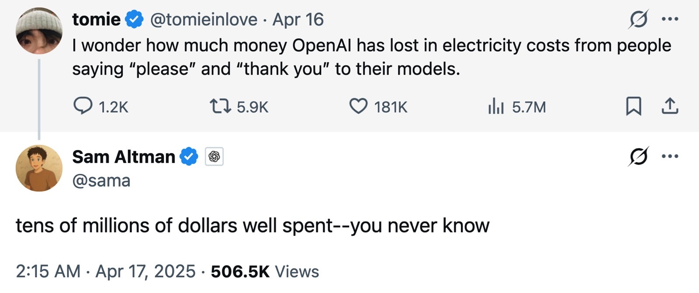
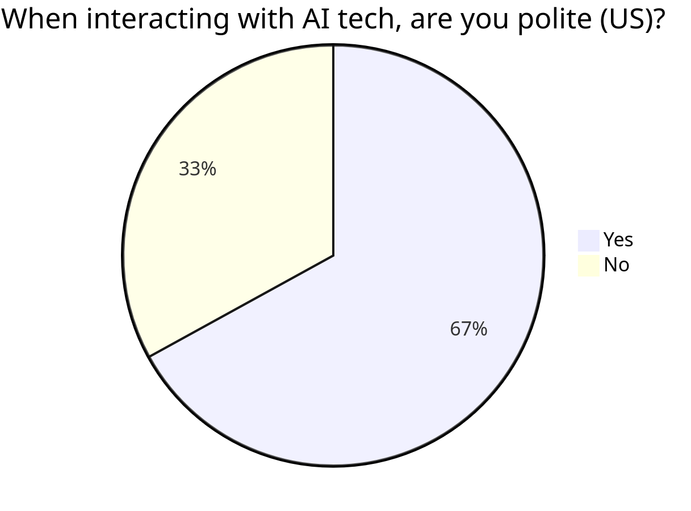
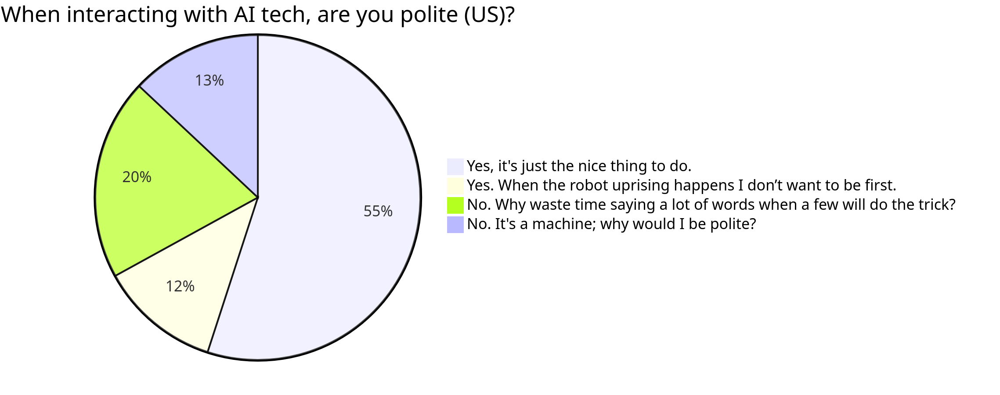
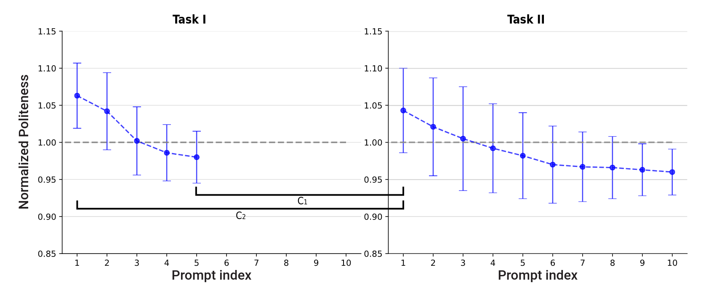
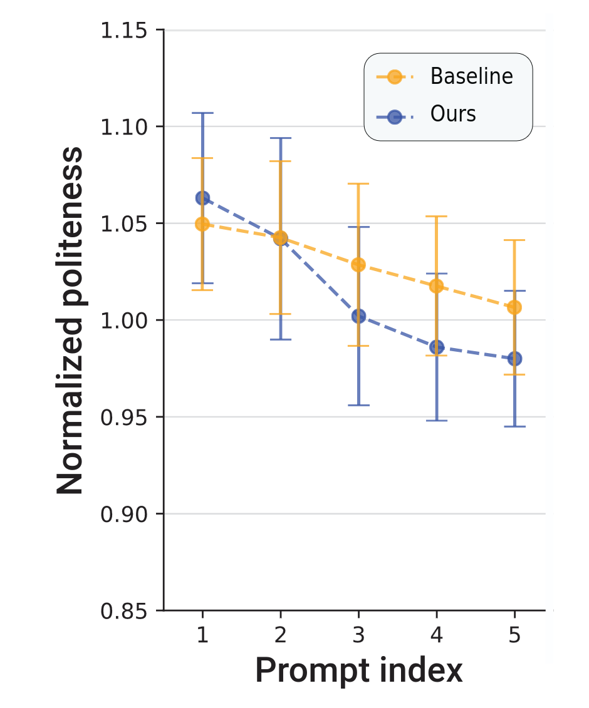
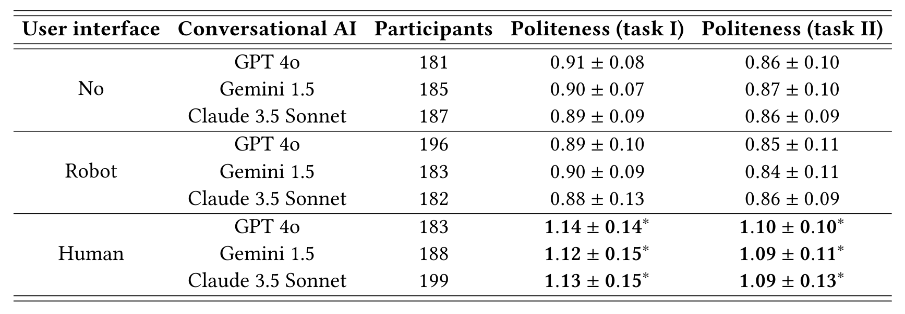

#+title: Mind Your Manners: The Dynamics of Politeness in Human-AI vs. Human-Human Interactions
#+subtitle: https://doi.org/10.1145/3757631
#+author: Juhun Lee
#+date: <2026-04-15 Wed>
#+options: h:2 toc:nil num:t
#+latex_class: beamer
#+latex_class_options: [presentation,table,10pt,aspectratio=169]
#+latex_header: \usepackage{stmaryrd}
#+latex_header: \usepackage{tikz}
#+latex_header: \usetikzlibrary{graphs, graphs.standard}
#+latex_header_extra: \institute{FCAI Lab \\Yonsei University}
#+latex_header_extra: \makeatletter
#+latex_header_extra: \renewcommand<>{\footnote}[1][]{%
#+latex_header_extra:   \let\beamer@footnotetext=\@footnotetext%
#+latex_header_extra:   \let\beamer@mpfn=\@mpfn%
#+latex_header_extra:   \let\beamer@thempfn=\thempfn%
#+latex_header_extra:   \let\beamer@kvorig=\KV@errx%
#+latex_header_extra:   \let\beamer@xkvorig=\XKV@err
#+latex_header_extra:   \def\beamer@footarg{}%
#+latex_header_extra:   \def\KV@errx##1{\edef\beamer@footarg{\@tempa}}%
#+latex_header_extra:   \def\XKV@err##1{\edef\beamer@footarg{\XKV@tkey}}%
#+latex_header_extra:   \setkeys{beamerfootnote}{frame}% <- changed here from #1 to frame
#+latex_header_extra:   \let\KV@errx=\beamer@kvorig%
#+latex_header_extra:   \let\XKV@errx=\beamer@xkvorig
#+latex_header_extra:   \ifx\beamer@footarg\@empty%
#+latex_header_extra:     \def\beamer@next{\stepcounter\beamer@mpfn
#+latex_header_extra:       \protected@xdef\@thefnmark{\beamer@thempfn}%
#+latex_header_extra:       \@footnotemark\beamer@footnotetext#2}%
#+latex_header_extra:   \else%
#+latex_header_extra:     \def\beamer@next{%
#+latex_header_extra:       \begingroup
#+latex_header_extra:         \csname c@\beamer@mpfn\endcsname\beamer@footarg\relax
#+latex_header_extra:         \unrestored@protected@xdef\@thefnmark{\beamer@thempfn}%
#+latex_header_extra:       \endgroup
#+latex_header_extra:       \@footnotemark\beamer@footnotetext#2}%
#+latex_header_extra:   \fi%
#+latex_header_extra:   \beamer@next}
#+latex_header_extra: \makeatother
#+columns: %45item %10beamer_env(env) %10beamer_act(act) %4beamer_col(col)
#+beamer_theme: fcai

* Motivation and Background

** We are /nice/ to AI models
#+caption: Sam Altman +complaining+ discussing about the monetary cost of being nice to AI.

** We are /nice/ to AI models (cont'd)
#+attr_latex: :height 0.6\textheight
#+caption: "US AI Sentiment tracker - Wave 2" , The Lens, Future plc, UK Nat Rep, Dec, 2024.

** We are /nice/ to AI models...... but WHY?
#+attr_latex: :height 0.6\textheight
#+caption: "US AI Sentiment tracker - Wave 2" , The Lens, Future plc, UK Nat Rep, Dec, 2024.

** Do social norms follow us into AI conversations?
- AI systems are increasingly embedded in collaborative works
  - co-workers
  - assistants
  - decision-support tools
  - etc.
- LLMs simulate human conversation, which naturally triggers familiar social norms like politeness

** Do social norms follow us into AI conversations? (cont'd)
- The CASA paradigm shows people unconsciously apply social rules, even to machines
- Politeness erosion toward AI may spill over to human-human contexts
  - Already observed by educators and parents

#+begin_center
Understanding these dynamics can inform how we design AI systems for mission critical environments: professional, educational, and healthcare settings.
#+end_center

* Overview

** Four questions about politeness and AI
- RQ1 :: How does politeness evolve /over time/ within a single human-AI interaction?
- RQ2 :: How does politeness in human-AI settings /compare/ to human-human interactions in similar mediated environments?
- RQ3 :: Which /user characteristics/ (age, gender, AI experience, etc.) predict politeness toward AI?
- RQ4 :: Does /anthropomorphism/, specificially giving an AI a human-like visual identity, influence how politely users communicate?
  
** A two-part study design: /baseline/ and /experiment/
- Part 1, human-human baseline :: Politeness scores computed from the MultiWOZ[fn:1] dataset
- Part 2, human-AI experiment :: 1,684 participants interacted with an LLM-powered chatbot across two sequential tasks

- Nine experimental condiditons
  - 3 UI icon types (none, robot, human face)
  - 3 LLM backends (GPT-4o, Gemini 1.5, Claude 3.5 Sonnet)
- Participants recruited by social media between May--July 2024
  - 4 platforms: Facebook, Telegram, Twitter, LinkedIn

** 1,684 participants, two tasks, one chatbot
- Demographics
  - 54% male, 42% female
  - Age 18--67 (average 32.6)
  - Majority held bachelor's degree or above
  - 50+% reported daily use of AI; 67% of them for work

- Task I :: Participants queried the chatbot about how snack bars work
- Task II :: Participants queried until they felt they /understood/ the concept of "presumption of innocence"

** But how do we measure /politeness/?
- ConvoKit /(Chang et al., 2020)/ is an open-source NLP toolkit for analyzing social phenomena in conversations
- Assigns a continuous politeness score to each user message using lexical and syntactic features
- Applied identically to both human-AI experiment and human-human dataset
- Non-normal score distributions confirmed by Shapiro-Wilk tests[fn:3]

* Results

** RQ1: Politeness declines, and doesn't fully recover
#+caption: The connection between the prompt index and the normalized politeness level across tasks.

** RQ1: Politeness declines, and doesn't fully recover (cont'd)
- Politeness declined monotonically within both tasks
  - ~8.4% drop in Task I
  - ~9.6% drop in Task II
- Decline was steeper in Task I than Task II
  - Simpler tasks trigger faster abandonment of formalities
- At the start of Task II, politeness rebounded relative to the end of Task I (cf. \(C_{1}\))
  - Context switching has a reset effect in politeness level
- Politeness at the start of Task II was significantly lower than at the start of Task I (cf. \(C_{2}\))
  - Cross-task spillover

#+begin_center
Users quickly shift from social norms to task efficiency; familiarity with the AI accelerates this shift.
#+end_center

** RQ2: Politeness erodes faster with AI than with humans
#+attr_latex: :height 0.6\textheight 
#+caption: A comparison between the human-human and human-AI level of politeness during and cross interactions.

** RQ2: Politeness erodes faster with AI than with humans (cont'd)
- Starting politeness levels were statistically similar between human-AI and human-human conditions
- Politeness in human-AI interactions declined significantly faster
- Human-human politeness /did/ decline, but more gradually and with lower variance

#+begin_center
Users quickly reframe AI as a functional tool rather than a social peer, deprioritizing politeness in favor of efficiency.
#+end_center

** RQ3: There are certain kinds of people who stay polite more
- Significant predictors of politeness in the regression model:
  - Old age
  - Male gender
  - Married status
  - Daily AI use (after demographic control)
- Daily AI use showed /suppression effect/, but positively associated with politeness when covariances are removed

** RQ4: Giving human avatars made people more polite
#+caption: The distribution of politeness level, normalized to the average politeness level on the message level, divided by the three user interfaces and conversational AI.

** RQ4: Giving human avatars made people more polite (cont'd)
- Human face avatar gave significantly higher politeness scores compared to other two conditions
  - Similar results across all three LLM backends
- Robot icon had no significant effect
  - The avatar cue needs to be specifically human-like to trigger social behavior

* Implications and Limitations

** What all these mean
- People consider AI as a mere tool, not a conversational party
- Adding a human-like avatar to conversational AI can reliably increase user politeness
- Declining politeness toward AI may have spillover effects on human-human communication

** Future works?
- The tasks conducted by participants were rather simple
  - Emotional support? Advice-seeking? Creative tasks?
- Short-term study with limited reproduction
  - Long-term, repeated-session effects remain unknown

* Discussion Questions

** Discussion Question #1
#+begin_center
This paper focuses on English-speaking, largely Western participants.
How do you think politeness dynamics with AI might differ across cultures, especially in Asian cultures with elaborate honorifics mechanism?
#+end_center

** Discussion Question #2
#+begin_center
This paper assumes that politeness towards AI is driven by transfer of baseline social norm.
Is this the only explanation of politeness towards AI, or is there a more functional explanation?
#+end_center

* Footnotes

[fn:3] Formal statistical method used to determine if a dataset is normally distributed.

[fn:2] Toolkit for extracting conversational features and analyzing social phenomena in conversations. 

[fn:1] Dataset of ~10,000 task-oriented dialogues between users and Mechanical Turk workers.
